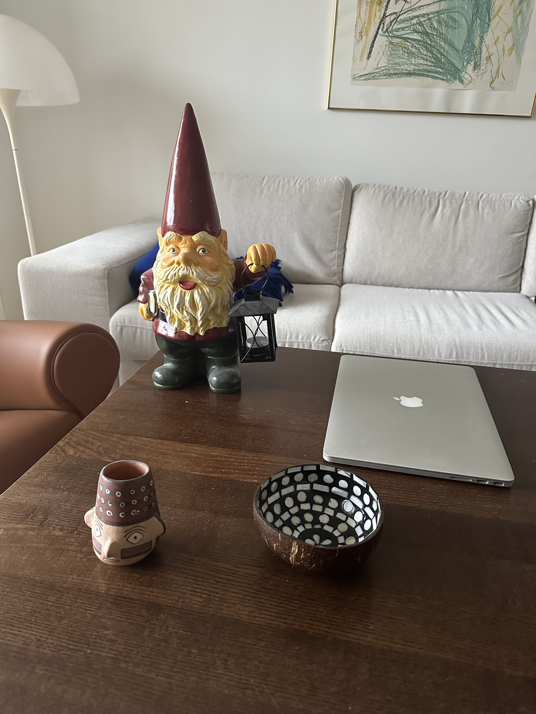
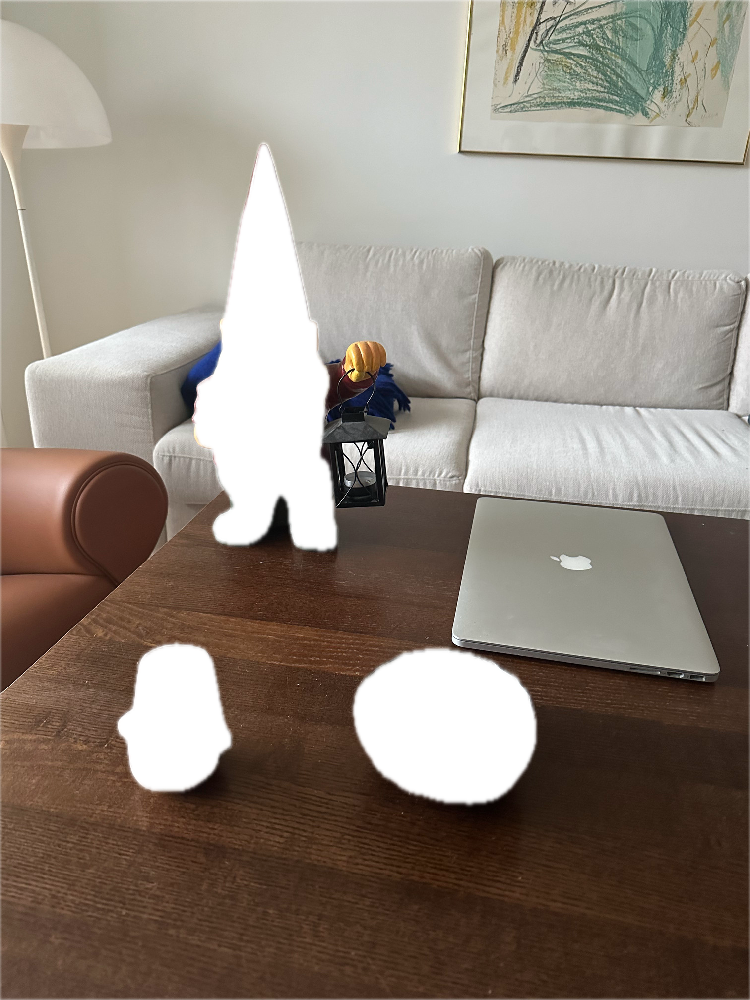
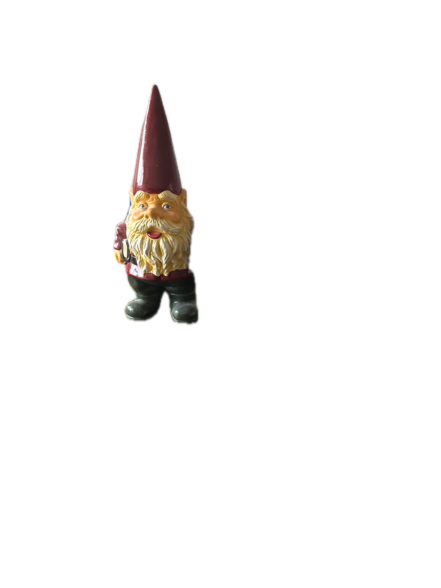
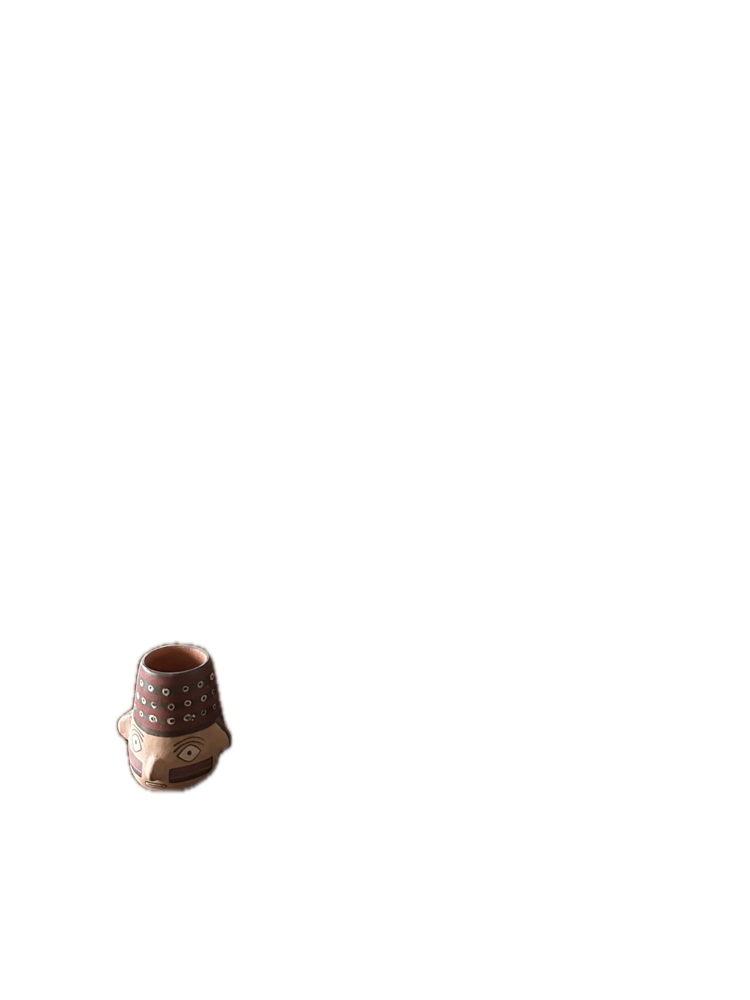
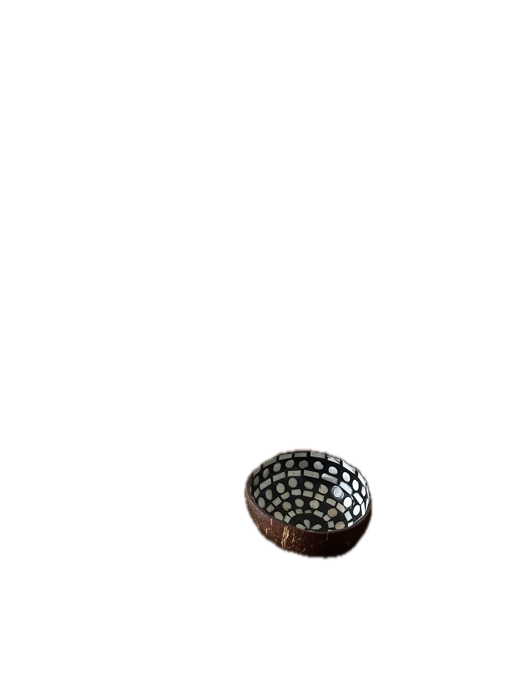

# MaskVisionTest

Command line example with Apple Vision foreground masking.

## Description

This is a small example / experiment with Apple Vision's framework Foreground Masking, which segments foreground objects from the background in an image.

I couldn't find any simple implementation example in Objective-C of Apple's Vision framework for foreground masking. So I made this small one-file example to test the new feature of iOS17 and macOS14.
The result is not quite a good as I hoped, but it is interesting. 

Everything is contained in the `MaskingTest/main.m` file.

It uses:

* VNGenerateForegroundInstanceMaskRequest to create a request to perform segmentation
* VNInstanceMaskObservation.instanceMask to get the instance mask, that for each pixel specifies which object instance the pixel belongs to
* VNInstanceMaskObservation.allInstances to output an image for each mask

This is a command line utility for macOS Sonoma (and above?), but the code should work fine with GUI iOS and macOS applications.

## Example Data

Running this tool with: 

    MaskingTest test_image/test_image.jpg test/
    
Will output the images in the test_output folder.

This performs the segmentation on the following image

And should output the masks of the objects found as well as the following separate images:

First the background (index 0):

Object 1:

Object 2:

Object 3:

The first output masked image is the background.